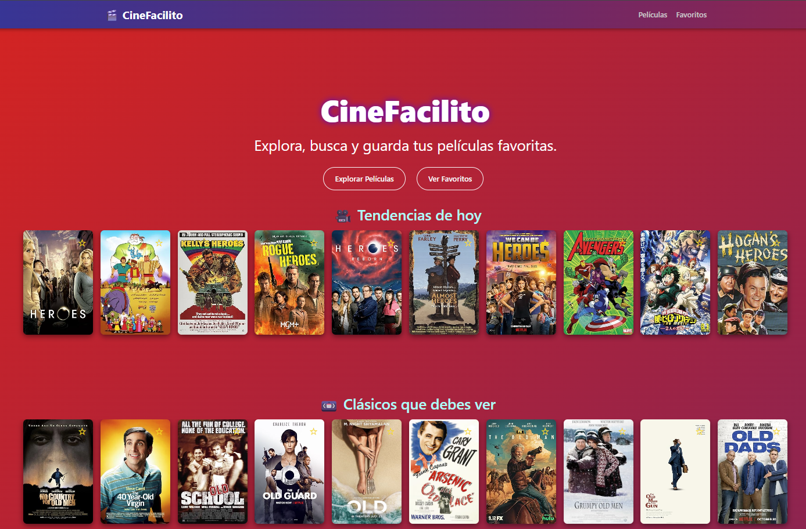
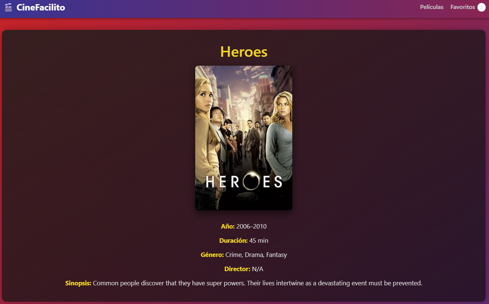
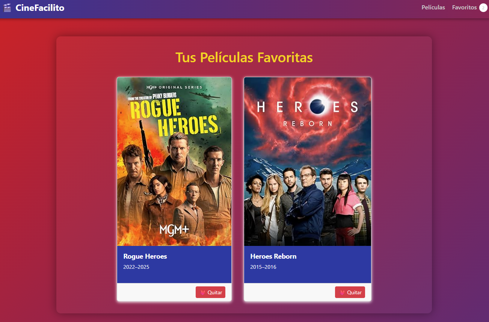

# 🎬 CineFacilito

**CineFacilito** es una aplicación web construida con React que te permite descubrir películas por categorías, visualizarlas en carruseles animados y agregarlas a tus favoritas.

---

## 🚀 Demo en vivo

🔗 [Ver proyecto en Vercel](https://cine-facil.vercel.app)

---

## 📸 Capturas de pantalla

<p align="center"><br>
<p>Pagina principal</p>
  <br>
  <p>Vista detalle de pelicula</p>
  <br>
  <p>Vista Buscar Pelicula</p>
  <br>
  <p>Vista Sección de Favoritos</p>
  <br>
</p>

---

## ⚙️ Tecnologías utilizadas

- **React** (CRA)
- **React Router DOM**
- **OMDb API** (para datos de películas)
- **CSS puro y modular**
- **Vercel** para despliegue
- **Git / GitHub** para control de versiones

---

## 📦 Instalación local

```bash
git clone https://github.com/joel-arteta-urbina/cinefacilito.git
cd cinefacilito
npm install
npm start

🎯 Funcionalidades
- Carruseles automáticos por categoría de búsqueda
- Detalles ampliados de cada película (actores, año, sinopsis...)
- Sistema de favoritos persistente
- Navegación fluida con React Router
- UI responsiva y animada

📁 Estructura del proyecto
src/
├── components/
├── hooks/
├── pages/
├── services/
├── styles/
└── App.js / index.js


👤 Autor
Creado por Joel Arteta Urbina
📫 artetaurbina@gmail.com

📄 Licencia
MIT

